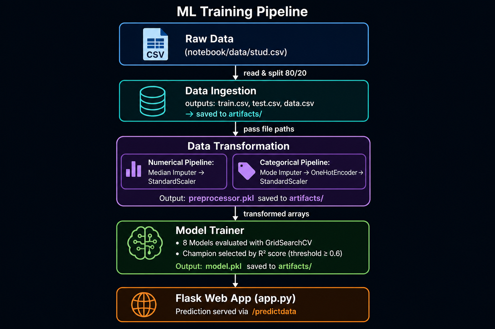
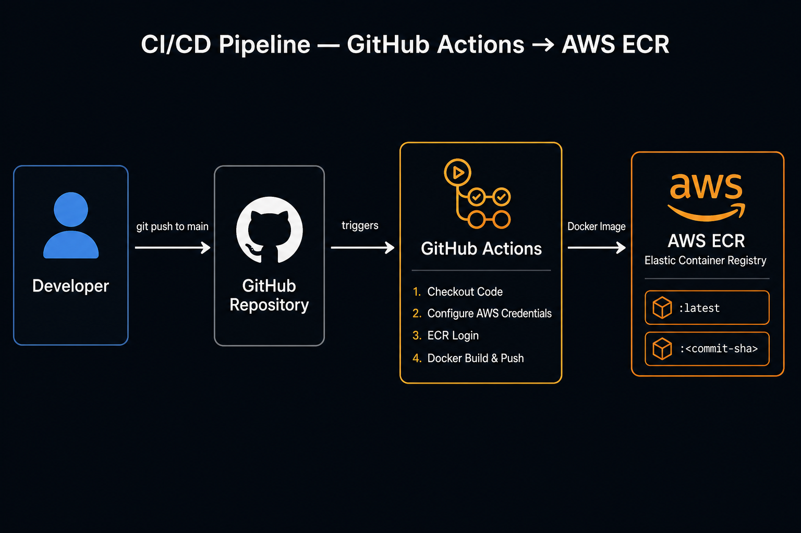

# Student Performance Predictor — End-to-End ML System with AWS CI/CD

A production-grade machine learning system that predicts a student's **math score** based on demographic and academic factors. The project wraps a complete Data Science core — EDA, feature engineering, multi-model training, and a Flask web app — inside a robust engineering layer: Docker containerisation, GitHub Actions CI/CD, and automated deployment to **AWS ECR**.

---

## What This Project Is About

> *The focus shifts from "Does the model work?" to "Is the pipeline robust and automated?"*

This is not just a machine learning model — it is a **deployable system**. The Data Science logic stays untouched; what changes is everything around it.

| Concern | Solution |
|---|---|
| Reproducible environments | `Dockerfile` locks the Python version, OS, and all dependencies — the same image runs on any machine or cloud server |
| Automated quality gate | GitHub Actions builds and validates the Docker image on every push to `main` — a broken build blocks deployment |
| Full traceability | Each Docker image is tagged with the **git commit SHA**, creating a clear audit trail from code change to running container |

---

## Tech Stack

| Layer | Technology |
|---|---|
| Language | Python 3.11 |
| Web Framework | Flask + Gunicorn |
| ML Libraries | scikit-learn, XGBoost, CatBoost |
| Data | pandas, NumPy |
| Containerisation | Docker |
| CI/CD | GitHub Actions |
| Cloud Registry | AWS ECR (Elastic Container Registry) |
| Packaging | setuptools (`setup.py`) |

---

## Project Structure

```
mlproject_AWS_CICD/
│
├── .github/workflows/
│   └── main.yaml              # CI/CD pipeline — builds & pushes Docker image to ECR
│
├── src/
│   ├── components/
│   │   ├── data_ingestion.py       # Reads raw data, splits into train/test
│   │   ├── data_transformation.py  # Preprocessing pipelines (scaling, encoding)
│   │   └── model_trainer.py        # Trains 8 models, selects champion by R²
│   │
│   ├── pipeline/
│   │   ├── train_pipeline.py       # Orchestrates training end-to-end
│   │   └── predict_pipeline.py     # Loads artifacts, runs inference
│   │
│   ├── exception.py                # Unified custom exception with traceback
│   ├── logger.py                   # Timestamped rotating log files
│   └── utils.py                    # Shared helpers: save/load objects, model evaluation
│
├── notebook/
│   ├── 1 . EDA STUDENT PERFORMANCE .ipynb   # Exploratory Data Analysis
│   ├── 2. MODEL TRAINING.ipynb              # Model experimentation
│   └── data/stud.csv                        # Raw source dataset
│
├── artifacts/                      # Auto-generated training outputs (gitignored)
│   ├── data.csv                    # Raw data copy
│   ├── train.csv / test.csv        # 80/20 stratified split
│   ├── preprocessor.pkl            # Fitted ColumnTransformer
│   └── model.pkl                   # Champion model (best R² score)
│
├── templates/
│   ├── index.html                  # Landing page
│   └── home.html                   # Prediction form and results
│
├── logs/                           # Timestamped application logs
├── app.py                          # Flask application entrypoint
├── Dockerfile                      # Container definition
├── requirements.txt                # Python dependencies
└── setup.py                        # Package setup for local `src` imports
```

---

## ML Pipeline



The training pipeline runs in three sequential, modular stages:

### 1. Data Ingestion (`data_ingestion.py`)
- Reads `notebook/data/stud.csv`
- Saves the raw dataset to `artifacts/data.csv`
- Performs an **80/20 train-test split** (random state 42) and writes `train.csv` / `test.csv`

### 2. Data Transformation (`data_transformation.py`)
Builds a `ColumnTransformer` with two sklearn `Pipeline` branches:

| Feature Type | Features | Steps |
|---|---|---|
| Numerical | `reading_score`, `writing_score` | Median imputation → StandardScaler |
| Categorical | `gender`, `race_ethnicity`, `parental_level_of_education`, `lunch`, `test_preparation_course` | Most-frequent imputation → OneHotEncoder → StandardScaler |

The fitted preprocessor is serialised to `artifacts/preprocessor.pkl`.

### 3. Model Trainer (`model_trainer.py`)
Evaluates **8 regression algorithms** with hyperparameter tuning via `GridSearchCV`:

| Model | Key Hyperparameters Tuned |
|---|---|
| Linear Regression | — |
| Decision Tree | criterion, max_depth, max_features, max_leaf_nodes |
| Random Forest | criterion, max_features, n_estimators |
| Gradient Boosting | loss, learning_rate, subsample, n_estimators |
| K-Neighbors Regressor | n_neighbors, weights, metric |
| XGBRegressor | learning_rate, n_estimators |
| CatBoosting Regressor | depth, learning_rate, iterations |
| AdaBoost Regressor | learning_rate, n_estimators |

The model with the highest **R² score** (minimum threshold: 0.6) is selected as the champion and saved to `artifacts/model.pkl`. If no model clears the threshold, the pipeline raises a `CustomException` and halts.

---

## CI/CD Pipeline



Every push to the `main` branch triggers the GitHub Actions workflow defined in `.github/workflows/main.yaml`:

```
git push → GitHub Actions triggers
    │
    ├─ 1. Checkout repository
    ├─ 2. Configure AWS credentials (from GitHub Secrets)
    ├─ 3. Login to Amazon ECR
    └─ 4. Build Docker image
           ├─ Tag with git commit SHA  →  push to ECR
           └─ Tag as `latest`          →  push to ECR
```

Each deployed image is tagged with the **commit SHA**, creating a full audit trail from code change to running container.

### Required GitHub Secrets

| Secret | Description |
|---|---|
| `AWS_ACCESS_KEY_ID` | IAM user access key |
| `AWS_SECRET_ACCESS_KEY` | IAM user secret key |
| `AWS_REGION` | e.g. `us-east-1` |

The ECR repository name is hardcoded as `studentperformance` in the workflow.

---

## Running Locally

### Prerequisites
- Python 3.11+
- Docker (for containerised run)

### 1. Install dependencies

```bash
pip install -r requirements.txt
```

### 2. Train the model

```bash
python src/components/data_ingestion.py
```

This runs the full training pipeline and writes all artifacts to the `artifacts/` directory.

### 3. Start the Flask app

```bash
python app.py
```

The app starts on `http://localhost:8080`. Navigate to `/predictdata` to use the prediction form.

### 4. Run with Docker

```bash
docker build -t studentperformance .
docker run -p 5000:5000 studentperformance
```

Access the app at `http://localhost:5000`.

---

## Prediction API

The web app accepts the following inputs via an HTML form (`POST /predictdata`):

| Input | Type | Example |
|---|---|---|
| `gender` | Categorical | `female` |
| `race_ethnicity` | Categorical | `group B` |
| `parental_level_of_education` | Categorical | `bachelor's degree` |
| `lunch` | Categorical | `standard` |
| `test_preparation_course` | Categorical | `completed` |
| `reading_score` | Float | `72` |
| `writing_score` | Float | `68` |

**Output:** Predicted `math_score` rounded to 2 decimal places.

---

## Logging & Error Handling

- **Logs** are written to timestamped files in the `logs/` directory (e.g. `04_30_2026_18_34_15.log`) using Python's `logging` module configured in `src/logger.py`.
- **Exceptions** are caught and re-raised as `CustomException` (defined in `src/exception.py`), which captures the file name and line number from the traceback for fast debugging.

---

## Author

**Srivalli** — [lsatya21@gmail.com](mailto:lsatya21@gmail.com)
